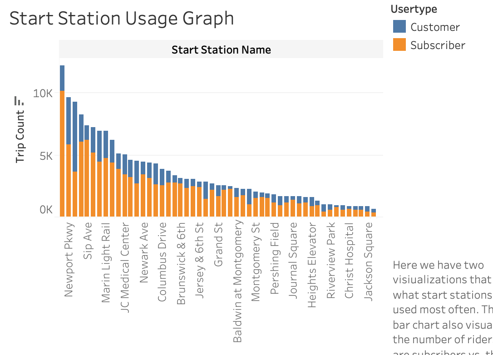
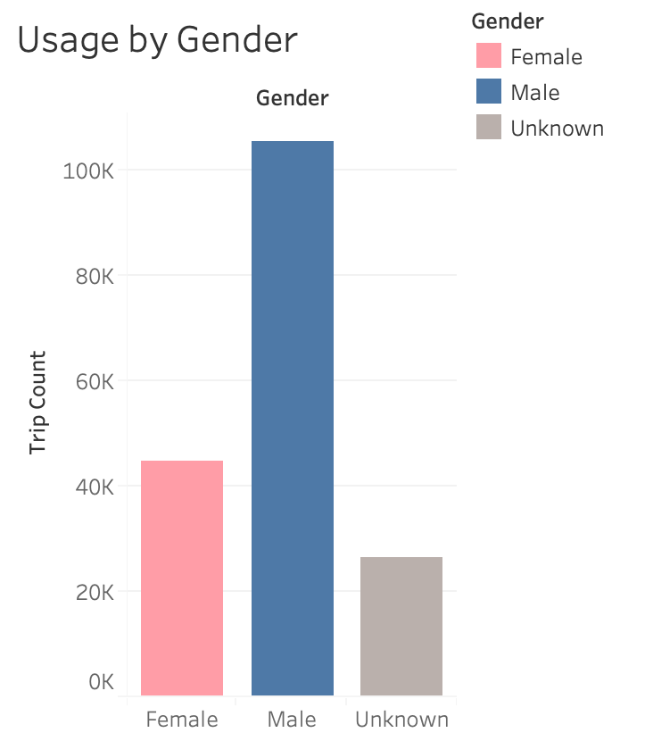
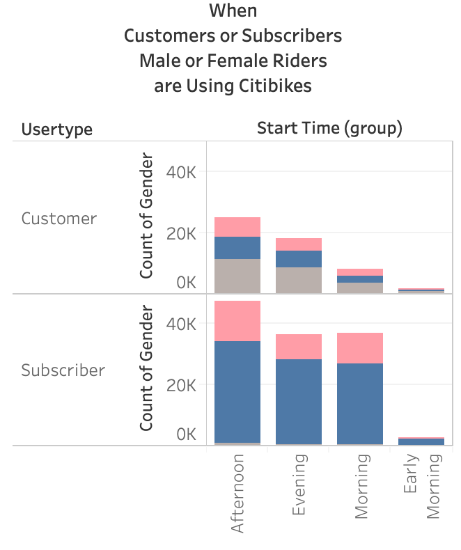

# Tableau_Challenge

## Repository Table of Contents
- Data Sources Folder: This folder contains the csv files used for the tableau analysis and visualizations.
- Citibike 2020 Data Visualization .twbx: This is the file that will take you to the Tableu Public location for this project.
- Tableau Links: This is a Microsoft Word File that includes all of the links to the pages associated with this Tableau Project.

## Synopsis
Citibike Ridership Finding (Jersey City)

We analyzed data using the Citibike Trip Data for Jersey City. The time frame for this analysis is between January 2020 and July 2020. Below are our findings.

Finding #1: Riders per Month

-- January and February had medium levels of riders using this service. This level of ridership can be explained by lower temperatures associated with the colder temperatures associated with January and February. We did notice a decrease in ridership between February and March which the opposite of what one might expect. April ridership was even lower than March. This finding corresponds city shutdown due to the Covid-19 pandemic. The data also indicates a sharp increase in ridership starting in May which corresponds with the re-opening. By June, ridership had increased to nearly 37,000 riders. To get an idea of the impact of Covid-19 on overall ridership we only need to look at the ridership in April (9,268) and compare it to June (36,921). This trend is consistent through all "Start Stations" through out the Jersey City Service Area.   

Finding #2: Start Station Usage

-- We looked at the data to determine which Citibike Start Station had the highest and lowest levels of usage. We found that the Grove Street Path start station had the highest levels of users reporting 12,181. The second highest was the Newport Parkway Station with 9,633 riders. The lowest was the JCBS Depot start station. It only reported 1 rider between January 2020 and July 2020. Based on our map plots, it looks like the start stations located closest to Public Transportation Hubs report the highest levels of usage. Additionally, of the 176,647 riders reported in this time period, we found that the large majority of the riders were subscribers with 123,814 compared to the 52,833 daily customers.
  

Finding #3: End Station Distance

-- When we looked at where bikes stopped, we found that most bikes were staying in the Jersey City area; however, we also discovered that there were many instances where bikes were obviously taken on trains as their end stations were reported as far away as Washington Heights in Manhattan and near Prospect Park in Brooklyn. Knowing this, calculating the average distance of rides will be misleading because we do not know how often riders are taking these bikes on public transportation. If they are taking the bikes on public transportation across the boroughs we can also assume some users are taking their bikes on public transportation even while staying in Jersey City.  

Finding #4: Usage by Gender

-- Male riders make up the largest group of riders, by far. We discovered that 44,697 reported riders during this time period were female compared to the 105,620 male riders. We did have a large number of "Unknown" riders reported. When we compared the "User Type" data with "Gender" we learned that the Daily Customers contained the largest number of "Unknown" riders. This is probably due to the sign up process for daily riders. In that process, it appears they are choosing to leave that field blank.  

Finding #5: When are Citibikes Being Used

-- We broke the "Start Time" into 4 groups, "Early Morning", "Morning", "Afternoon" and "Evening". These groups are defined as follows.

"Early Morning": Riders start their ride between the hours of 12:00 AM and 6:00 AM
"Morning": Riders start their ride between 6:00 AM and 12:00 PM
"Afternoon": Riders start their ride between 12:00 PM and 6:00 PM
"Evening: Riders start their ride between 6:00 PM and 12:00 midnight

By this grouping we found that the most common time to use a Citibike was "Afternoon". 72,214 of the 176,647 rides reported in this time period started between 12:00 PM and 6:00 PM. 44,729 rides started in the "Morning" and 55,037 started in the "Evening". We expected that the "Morning" numbers and the "Afternoon" numbers would be closer together as we hypothesized that ridership was impacted the most by peoples' commute to and from work. These numbers are obviously effected by the time frames we used to form our groups. Perhaps the "Morning" and the "Afternoon" groups would be closer if we adjusted the "Afternoon" time frame to end at 5:00pm. That would bring the "Afternoon" numbers down, making the two groups show closer numbers of overall riders. That would also increase the number of "Evening" riders. To gain a better understanding of how the time of day impacts ridership, more time manipulation will be needed. With that being said, we were surprised to learn that so many rides were occurring in the "Evening".  

